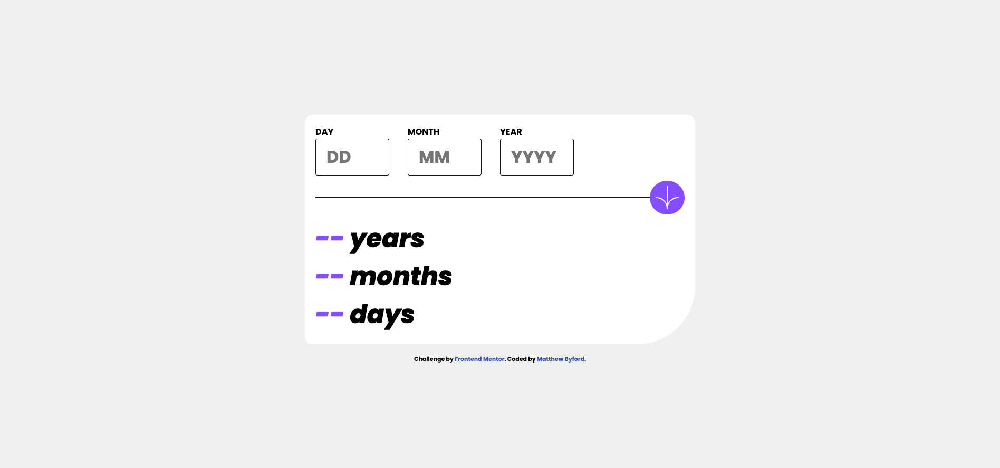

# Frontend Mentor - Age Calculator App

This is a solution to the [Age Calculator App challenge on Frontend Mentor](https://www.frontendmentor.io/challenges/age-calculator-app-dF9DFFpj-Q/hub). Frontend Mentor challenges help you improve your coding skills by building realistic projects. 

## Table of contents

- [Overview](#overview)
  - [Screenshot](#screenshot)
  - [Links](#links)
- [My process](#my-process)
  - [Built with](#built-with)
  - [What I learned](#what-i-learned)
  - [Continued development](#continued-development)
- [Author](#author)

## Overview

### Screenshot

**Note: Delete this note and the paragraphs above when you add your screenshot. If you prefer not to add a screenshot, feel free to remove this entire section.**

### Links

- Solution URL: [Add solution URL here](https://github.com/MrByford/Front_End_Mentor_Projects/tree/main/Age_Calculator_App)
- Live Site URL: [Add live site URL here](https://mrbyford.github.io/Front_End_Mentor_Projects/Age_Calculator_App/age_calculator_app.html)

## My process

### Built with

- SCSS / SASS
- Flex
- Semantic HTML Markup
- Google Fonts
- JS / ES6

**Note: These are just examples. Delete this note and replace the list above with your own choices**

### What I learned

This project has allowed me to read back through my JS ES6 notes i have made throughout some online courses and allowed me to put into practice the knowledge. I have been able to achieve with no doubt lots of improvement opportunities the use of Variables, If Statements and Logic to provide styling depending on the entry from the user. 

### Continued development

I will continue to develop my skills to get out of IF Hell! There is a lot of it in my solution. I will refine my code once I have been able to cover more topics and come back to address the logic that will remove the class '.error' when the function is called again unless the argument is still true and the error class is still required.

Developing a more in-depth awareness of input elements and UI / UX will allow me to style these responsively so they seamlessly adapt screen sizes. 

## Author

- Website - [Matthew Byford]
- Frontend Mentor - [@MrByford](https://www.frontendmentor.io/profile/MrByford)
